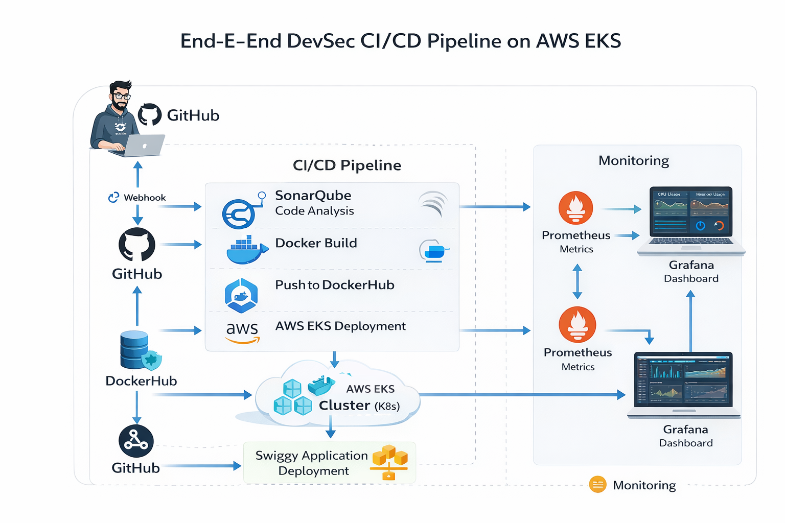

# Deployment-of-Swiggy-Clone-App


# 🚀 End-to-End DevOps CI/CD Pipeline on AWS EKS

### Production-Grade DevSecOps Pipeline using  
**GitHub Actions • SonarQube • Docker • Kubernetes • Prometheus • Grafana**

---

<p align="center">


</p>

---

## 📌 Overview

This project demonstrates a **production-grade end-to-end DevSecOps CI/CD pipeline** deployed on **AWS EKS (Kubernetes)**.

The pipeline automates the complete workflow:

- ✅ Build & Test Application  
- 🔍 Code Quality Analysis (SonarQube)  
- 🔐 Security Scanning  
- 🐳 Docker Image Build & Push  
- ☸️ Kubernetes Deployment (EKS)  
- 📊 Monitoring with Prometheus & Grafana  

---

## 🏗️ Architecture



---

## 🧩 Architecture Flow


---

## ⚙️ Tech Stack

| Category            | Tools Used |
|--------------------|-----------|
| CI/CD              | GitHub Actions (Self-hosted Runner) |
| Code Quality       | SonarQube |
| Containerization   | Docker |
| Registry           | DockerHub |
| Orchestration      | Kubernetes (AWS EKS) |
| Cloud              | AWS EC2, AWS EKS |
| Monitoring         | Prometheus, Grafana |

---

## 🔁 CI/CD Workflow

### 🔹 Continuous Integration
- Code pushed to GitHub
- Pipeline triggered automatically
- SonarQube analysis performed
- Dependencies installed
- Docker image built & pushed

### 🔹 Continuous Deployment
- Kubernetes pulls latest image
- Application deployed on EKS
- Service exposed via LoadBalancer

---

## ☸️ Kubernetes Deployment

- Deployment manages application pods  
- Service exposes app publicly  
- Multiple replicas ensure availability  

---

## 📊 Monitoring & Observability

### 🔹 Prometheus
- Collects system & cluster metrics  

### 🔹 Grafana
- Visualizes metrics in dashboards  

### 📈 Metrics
- CPU Usage  
- Memory Usage  
- Pod Health  
- Network Traffic  

---

## 🚀 Setup Instructions

### 1️⃣ Clone Repo
```bash
$git clone https://github.com/faizan-ab/Swiggy-Clone-Deployment.git
$cd Swiggy-Clone-Deployment
```

### 2️⃣ Configure Secrets
```
$SONAR_TOKEN
$SONAR_HOST_URL
$DockerHub credentials
```

3️⃣ Run Pipeline
```
Bash
$git push origin main
```

4️⃣ Deploy App
```
Bash
$kubectl apply -f deployment.yaml
$kubectl apply -f service.yaml
```

5️⃣ Access App
```
Bash
$kubectl get svc
```

6️⃣ Monitoring Setup
```Bash
$helm install monitoring prometheus-community/kube-prometheus-stack
```

## 📸 Screenshots

🔹 CI/CD Pipeline
�
🔹 SonarQube
�
🔹 DockerHub
�
🔹 Kubernetes Pods
�
🔹 Service (LoadBalancer)
�
🔹 Live App
�
🔹 Grafana Dashboard
�
🧠 Challenges & Fixes
Issue
Solution
SonarQube not reachable
Fixed network config
Disk full
Cleaned Docker & resized volume
Docker permission denied
Added user to docker group
Runner offline
Restarted runner
kubeconfig lost
Reconfigured using AWS CLI
🏆 Key Achievements
Built full DevSecOps pipeline
Deployed scalable app on EKS
Integrated CI/CD + Security
Implemented monitoring system
🚀 Future Enhancements
ArgoCD (GitOps)
Auto Scaling (HPA)
HTTPS (Ingress + ALB)
👨‍💻 Author
Mohammed Faizan
Aspiring DevOps & Cloud Engineer
